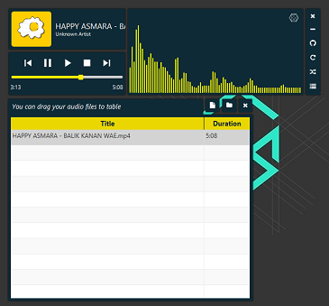
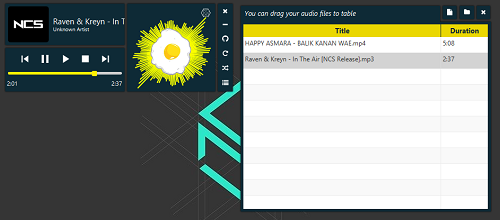

# Ceplok Media Player
 MP3 Player With Your Favorite EGG :D

## Download app
  - [Ceplok Media Player v1.0.2.zip](https://github.com/rizalmf/Ceplok-Player/raw/filerepo/out/Ceplok%20Media%20PlayerV1.0.2.zip) (JRE 8 and JavaFx 8 SDK needed).
  - [Ceplok Media Player v1.0.2-Installer.exe](https://github.com/rizalmf/Ceplok-Player/raw/filerepo/out/Ceplok%20Media%20PlayerV1.0.2-Installer.exe) (Windows only).

### Screenshot

### Changelog
- v1.2.2
   - minor bug volume control, add scrollable volume
- v1.2.1
   - add volume control
- v1.1.1
   - improve ndog visualizer performance
- v1.1.0
   - add TrackVisualizer, fix focus node
- v1.0.2(build ready)
   - fix wording, bug selection table
- v1.0.1
   - improve ndog visualizer performance
- v1.0.0
   - first commit
