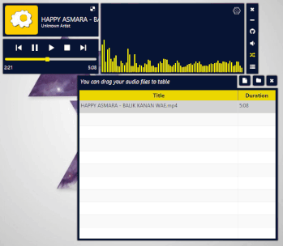
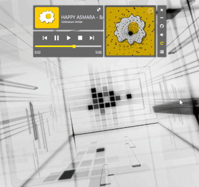
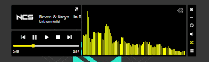

# Ceplok Media Player
 MP3 Player With Your Favorite EGG :D

## Download app
  - [Ceplok Media Player v1.3.1.zip](https://github.com/rizalmf/Ceplok-Player/raw/filerepo/out/Ceplok%20Media%20PlayerV1.3.1.zip) (JRE 8 and JavaFx 8 SDK needed).
  - [Ceplok Media Player v1.3.1-Installer.exe](https://github.com/rizalmf/Ceplok-Player/raw/filerepo/out/Ceplok%20Media%20PlayerV1.3.1-Installer.exe) (Windows only).
  - [Older version..](https://github.com/rizalmf/Ceplok-Player/tree/filerepo/out) ().

### Screenshot

### Changelog
- v1.3.3
   - fix binding volume from stop
- v1.3.2
   - fix major bug delete table list, fix binding volume, fix random issue
- **v1.3.1 (build ready)**
   - save color choosed, fix bug magnitude listener, fix shortcut keyboard
- v1.3.0
   - add change color, fix bug track visualizer
- v1.2.2
   - minor bug volume control, add scrollable volume, add shortcut keyboard
- v1.2.1
   - add volume control
- v1.1.1
   - improve ndog visualizer performance
- v1.1.0
   - add track visualizer, fix focus node
- **v1.0.2 (build ready)**
   - fix wording, bug selection table
- v1.0.1
   - improve ndog visualizer performance
- v1.0.0
   - first commit
